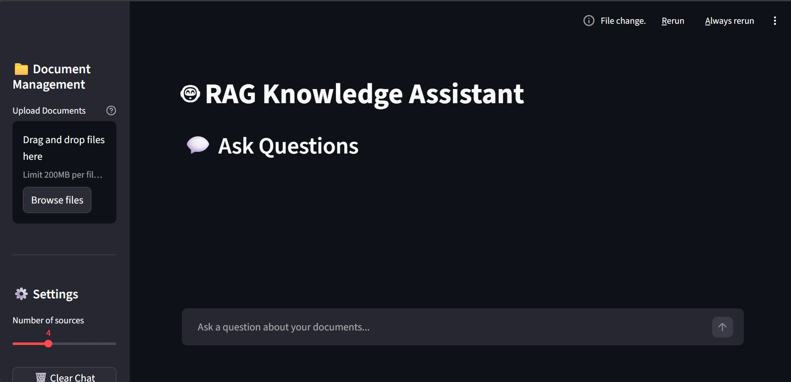
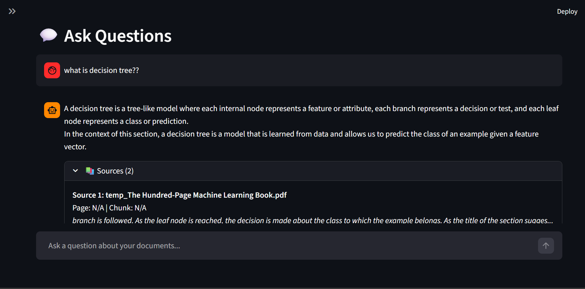

# 🤖 RAG Knowledge Assistant

An AI-powered document Q&A system that lets you upload documents and ask questions about them using **Retrieval Augmented Generation (RAG)**.

## 🌟 Features

- 📁 **Multi-format Support**: Upload PDF, DOCX, and TXT files
- 💬 **Intelligent Q&A**: Ask questions and get accurate answers from your documents
- 🔍 **Source Citations**: See exactly where answers come from with page numbers and excerpts
- ⚡ **Fast Processing**: Powered by Groq's high-speed LLM inference
- 💾 **Persistent Storage**: Your documents stay indexed between sessions (local ChromaDB)
- 
## 🚀 Live Demo

Try it out: **[Live Application Demo](https://your-app-name.streamlit.app)**  
*(Update this link after deploying on Streamlit Cloud)*

## 📸 Screenshots

| Main Interface                          | Q&A with Sources                        |
|-----------------------------------------|-----------------------------------------|
|  |  |

*(Add real screenshots to a `screenshots/` folder after testing)*

## 🛠️ Tech Stack

- **Frontend** → Streamlit
- **LLM** → Groq (Llama 3.1 8B or similar)
- **Embeddings** → Sentence Transformers (`all-MiniLM-L6-v2`)
- **Vector DB** → ChromaDB
- **Document Processing** → LangChain loaders (PyMuPDF, Text, Docx2txt)
- **Framework** → LangChain (LCEL chains)

## 📋 How It Works

1. **Upload Documents** 📄  
   User uploads PDF, DOCX, or TXT files  
   Documents are processed and split into chunks

2. **Create Embeddings** 🧮  
   Each chunk is converted to a vector embedding  
   Embeddings are stored in ChromaDB

3. **Ask Questions** ❓  
   User asks a question  
   System finds relevant chunks using semantic search

4. **Generate Answer** 💡  
   Relevant chunks are sent to Groq LLM  
   AI generates an answer based on the context  
   Sources are provided with page numbers

## 🐛 Known Issues / Limitations

- Large PDFs: Files over 50 pages may take longer to process
- Scanned PDFs: OCR not currently supported
- Image-heavy docs: May result in lower quality chunks
- Streamlit Cloud (free tier): Indexed documents are temporary per session — reset after inactivity or redeploy

## Future Enhancements (Planned)

Persistent multi-user storage (Pinecone / Qdrant)
Authentication & user sessions
Chat history & conversational memory
FastAPI backend + REST API
Hybrid search (keyword + semantic)
OCR support for scanned PDFs
CI/CD with GitHub Actions

Built With ❤️ by
Astha

